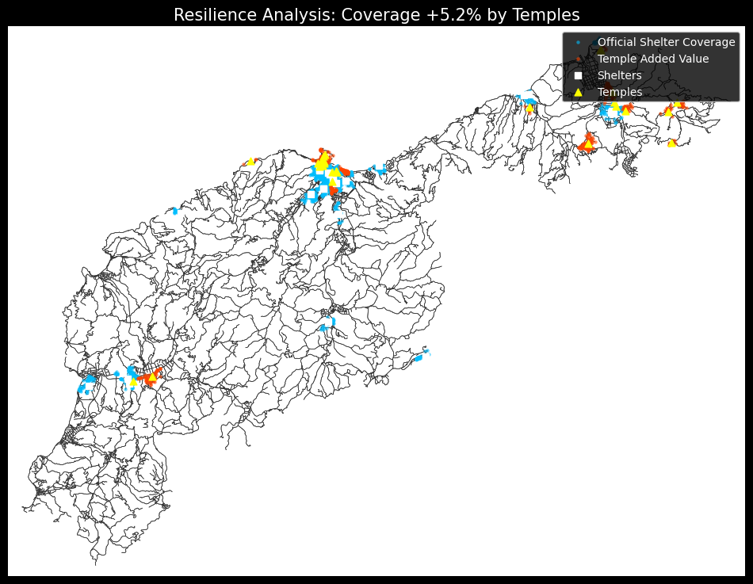

# Using Temples for Disaster Relief: A GIS Analysis in Wajima City (PoC, Hypothesis verification)

## 1. Project Overview
* **Goal:** To verify if Buddhist temples can serve as **"Emergency Shelters"** in aging communities.
* **Context:** Case study of **Wajima City** (hit by the 2024 Noto Earthquake).
* **Method:** Calculated the **15-minute walking range (720m)** for both official shelters and temples using OpenStreetMap road networks.

## 2. Key Visualizations

> **Figure 1: Coverage Gap Analysis.**
> * 🟦 **Blue dots:** Areas covered by official shelters.
> * 🟧 **Red/Orange dots:** Areas that are **only** covered by temples (filling the gaps).

## 3. Preliminary Results
| Metric | Coverage | Note |
| :--- | :--- | :--- |
| **Current Coverage** | **19.4%** | Official shelters only. |
| **Coverage with Temples** | **24.6%** | With Temples added. |
| **Impact** | **+5.2%** | A **~26.8% improvement** in the safety net, specifically in isolated areas. |

## 4. Technical Stack
* **Data:** OpenStreetMap (via `osmnx`), Project PLATEAU (concept).
* **Tools:** `Python`, `NetworkX` (Pathfinding), `Geopandas`, `Matplotlib`.
* **Data Processing:** Converted building shapes into **center points** and adjusted coordinates (Lat/Lon to Meters) for accurate distance calculation.

## 5. Limitations & Future Work
* **Current Limit:** This model assumes flat ground (ignores hills).
* **Future Plan (Master's Thesis):**
    1.  Use **Elevation Data** to calculate walking speed on slopes (important for the elderly).
    2.  Use **Simulation** to model how people evacuate during a panic.
